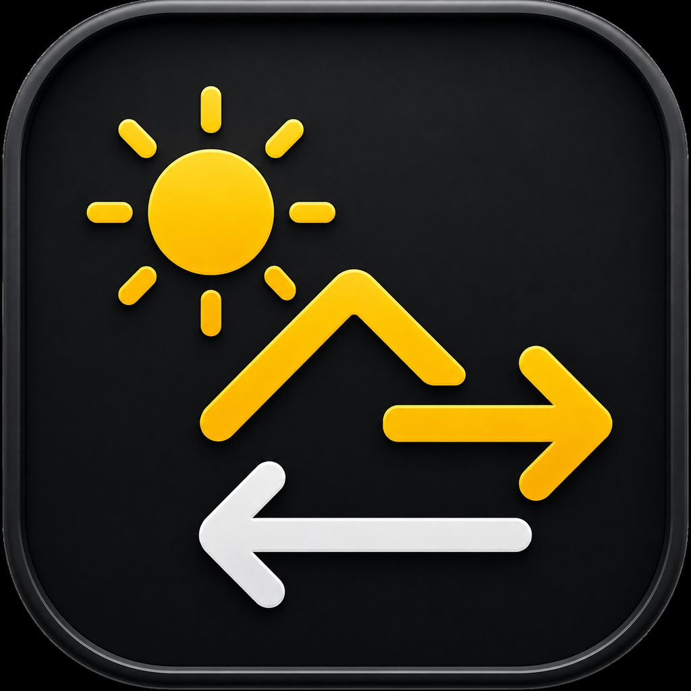
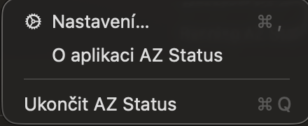

<div align="center">



# AZ Status

**Real-time A-Z Router monitoring in the macOS menu bar.**

[](#requirements)
[](https://github.com/volfion/az-status/releases)
[](https://github.com/volfion/az-status/actions/workflows/build.yml)
[](LICENSE)

[Download](https://github.com/volfion/az-status/releases) ·
[Report a bug](https://github.com/volfion/az-status/issues/new?template=bug_report.yml) ·
[Request a feature](https://github.com/volfion/az-status/issues/new?template=feature_request.yml)

</div>

AZ Status is a lightweight native macOS utility that shows current photovoltaic production and energy flows from an A-Z Router. It communicates directly with the router on the local network and runs only in the menu bar—without a Dock icon.

> Created by **Ondřej Vlček** ([@volfion](https://github.com/volfion)).  
> AZ Status is an independent community project and is not affiliated with or endorsed by A-Z TRADERS s.r.o.

## Highlights

- Live photovoltaic production in the menu bar
- Icon + power, icon only, or power only
- Monochrome or state-colored status icon
- House load, EV charging, battery, grid flow and temperatures
- Compact real-time energy-flow diagram
- Czech, English, German, Slovak and Polish interface
- Refresh interval from 5 seconds to 5 minutes
- Optional connection-loss and reconnection notifications
- Local password stored in macOS Keychain
- Optional launch at login
- No analytics, cloud account or external data transfer

## Preview



Additional current screenshots can be added to [`docs/screenshots`](docs/screenshots).

## Requirements

- macOS 13 Ventura or newer
- A-Z Router available at `http://azrouter.local`
- Local A-Z Router login credentials
- Mac connected to the same local network as the router

## Installation

### GitHub Release

1. Download the latest `.dmg` from [Releases](https://github.com/volfion/az-status/releases).
2. Open it and drag **AZ Status.app** to **Applications**.
3. Launch the app from **Applications**.
4. Enter the local A-Z Router password when requested.

AZ Status is currently distributed without Apple notarization. On first launch, Control-click the app and choose **Open**. Alternatively, allow it under **System Settings → Privacy & Security**.

### Homebrew

The repository contains a Homebrew Cask template. Once the public tap is available:

```bash
brew tap volfion/tap
brew install --cask az-status
```

### Build from source

1. Clone the repository:

   ```bash
   git clone https://github.com/volfion/az-status.git
   cd az-status
   ```

2. Open `AZRouterMenu.xcodeproj` in Xcode.
3. Select the app target and your Personal Team under **Signing & Capabilities**.
4. Choose **Product → Clean Build Folder**.
5. Build with `⌘B` or run with `⌘R`.

## First setup

The app connects to:

```text
http://azrouter.local
```

Use the local A-Z Router credentials, not the credentials for `new.azrouter.cloud`. The password is stored in the user’s macOS Keychain.

## Creating a DMG

On macOS with Xcode installed:

```bash
chmod +x scripts/*.sh
./scripts/build-release.sh 1.4
```

Artifacts are written to `dist/`. The current build is ad-hoc signed and not notarized.

## Releasing a version

Create and push a version tag:

```bash
git tag v1.4
git push origin v1.4
```

The release workflow builds the app on GitHub Actions, creates the DMG and attaches the release artifacts.

## Privacy and security

AZ Status reads data directly from the local A-Z Router. It contains no analytics or advertising and does not upload monitoring data to third parties.

- [Privacy policy](PRIVACY.md)
- [Security policy](SECURITY.md)

## Contributing

Bug reports, translations and focused improvements are welcome. Read [CONTRIBUTING.md](CONTRIBUTING.md) before opening a pull request.

## License

AZ Status is available under the [MIT License](LICENSE).
